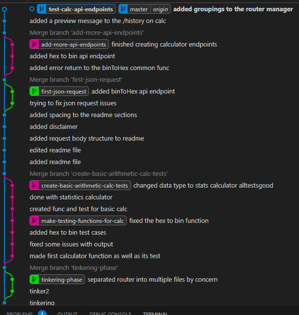

# My First Golang Gin Server

## Description

This is just a basic project to get familiarized with golang, I just got started with go and want to get familiarized with the syntax, golang's methodology and the processes, methods and capabilities of Gin before I do more complex projects. The project consist on a Rest API in which you make a request and it calculates a specific mathematical function and returns values based on your input. I may try out other features of gin such as adding web drivers, authentication, permissions and advanced validation, but for now I will just make  API post requests without any auth and get the result on a json response. 
**Disclaimer:** Please have in mind that  this is a work in progress and not everything below is ready yet

## Tools to be Used 
- A server technology, in this case, as I want to tinker with golang, it will be golang gin
- A database, first option is postgresql, second option can be a mongo atlas instance on local computer or docker for development
- Postman to end to end testing of API calls
- Testing library for golang, I will have to research on this
- If I find any tool that can make this work easier on testing, or input validation, I will use it
- Input validation will be regex or basic data type / number validation when Necessary
- For authentication may go for cookies validation for the moment, as it is not that complicated in most languages, IDK how it is on golang but will see

## API Structure

### Address Structure

- api/v1
    - /calculator/ (no api calls allowed on this exact address, but on children)
        - all the calculators names are children of this, post request only
            - basic-calculator
            - bin-to-hex-converter
            - hex-to-bin-converter
            - sample-statistics-calculator
        - /history, get request, to get all calculator operations saved by him and other users
        - /history/<some filter> may be possible in the future
    - /user (no api calls allowed on this exact address, but on children)
        - /profile, get request, user has to be authenticated, may do delete and put request for editing profile data in the future, but for now only get
        - /login, post only, if authentication successful user can acces data on its profile
        - /register, post only, user has to /login to authenticate

### Request Body Structure for Calculator calls
- /api/v1/calculator/basic-calc → **post** request; **request-body**: {params: (num1, num2, operand)}; **response**: {responseStatus, requestParams, date, result: (value), user(username or anon user)}
- /api/v1/calculator/hex-to-bin → **post** request; **request-body**: {params: (hexString)}; **response**: {responseStatus, requestParams, date, result: (binString), user}
- /api/v1/calculator/bin-to-hex → **post** request; **request-body**: {params: (binString)}; **response**: {responseStatus, requestParams, date, result: hexString, user}
- /api/v1/calculator/statistics-calc → **post** request; **request-body**: {params: (… nums)}; **response**: {responseStatus, requestParams, date, result: (mean, median, standardDeviation), user}
- /api/v1/calculator/history → **get** request; **response**: {responseStatus, calcType, requestParams, date, result, username}

### Request Body Structure for user calls
- /api/v1/user/profile → **get** request; **response**: {responseStatus, username, firstName, lastName, userSince, emailAddress, birthDay}; **needs authentication**
- /api/v1/user/login → **post** request; **request-body**: {usernameOrEmailAddress, password}; **response**: {responseStatus, responseMessage}; **needs authentication**
- /api/v1/user/register → **post** request; **request-body**: {username, firstName (optional), lastName (optional), emailAddress, password, passwordConfirmation, birthDay (optional)}; **response**: {responseStatus, , responseMessage}; **needs authentication**

## Folder structure of the project

- root (package main)
    - routes 
    - common
        - calculator: calculator function directory
        - validator: validator functions directory
        - authentication:authentication methods directory
        - other: stuff such as authentication middleware (may change)
    - config
        - db, environment variables, authentication, testing, url validation, etc configuration files
    - model
        - queries, views, other model files
    - controller
        - the middle point between the api routes and the model back and forth, uses common functions
        - Invalid call api views
    - tests
        - all tests files go here (probably split it in subdirectories by purpose)

    - main file
    - readme file
    - mod and checksum files (.mod and .sum)

## Updates

Updates and milestones go here

### #1 Why you only see the main branch on public server?

The reason for that is because I am not publishing the main, as I am discovering the goods and features of golang, I don't want to embarrass in public, I want to experiment in private, clean the messes that I make in the process and publish when I have a good version.

Above you can see how I am doing my branching well enough, you are able to observe that I am making changes on different branches and then pulling and merging the changes to main branch. I could be more sophisticated pushes on specific directories or files, pull request, etc. but as this is a guy programmer project so I don't see the need for that.

### #2 Added Postgres database connection

Added a basic database connection, I may add environment variables, but for now I left the default username, port and password and loopback IP address so I don't see a need for now. As I previously told, this is a tinker server and I can refine it later. All automated for basic db connection and sample query tests passed at this moment. All components of the server as of now run well and pass unit tests, and the API calls get the desired results.

### #3 Improved postgres databased, and implemented more to api views

Improved Databases, I have now a docker persistent container for it, and also have a test docker mock database that recreates and deletes on every run. All the calculation api calls save records to this database and a listing of all of them can be called with /api/v1/calculators/history using a get request. This project now has environment variables, for extra layer of security. Added 3 user input validation methods, for password, password confirmation matches and email, as well as user database methods and models.

At this moment I am in the process of implementing sessions and user authorization using oauth2, and adding user api endpoints. I will see how I can implement reliability and security features such as access permissions and DDoS attacks protections, as well as request encryptions.

### #4 Added user register, authentication and authorization methods
Added all these methods mentioned, as well as password encryption and hash validation methods. Also made a few changes to the response body of the user calls to explain better any errors that occur without returning "err.Error()", which is a bad security practice. I My next step will be to secure authentication token on the client browser using cookie encryption. I am also adding logout (will delete the cookie from the client browser and invalidate or wipe out the cookie from the server), and put methods for deleting user data. Calculator controllers need to also check if the user is authenticated to add it's username to the database entry, or save them as anon if not auth. I will do more unit tests to validate input, output and the interaction between all my methods. And finally when all of that is done I will test deployment on a cloud VPS of my choosing.